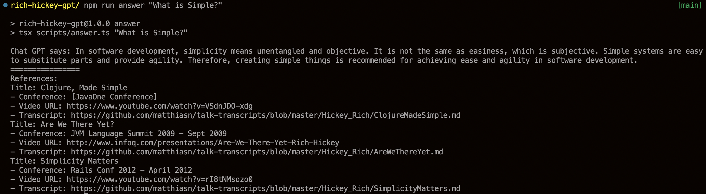

# Rich Hickey GPT

Chat GPT with [Rich Hickey](https://en.wikipedia.org/wiki/Rich_Hickey)



## Respect

- Rich Hickey
- https://github.com/mckaywrigley/paul-graham-gpt
- https://github.com/matthiasn/talk-transcripts/blob/master/Hickey_Rich/

## Get Started

```sh
$ npm install
$ export OPENAI_API_KEY=YOUR_API_KEY # recommend direnv
```

Run

```sh
$ npm run answer "What is Simple?"
```

### Optional

Scrape and refresh data.db

```sh
$ npm run scrape
```

Embedding

```sh
$ npm run embed
```

## Why don't you use Clojure?

Sorry
